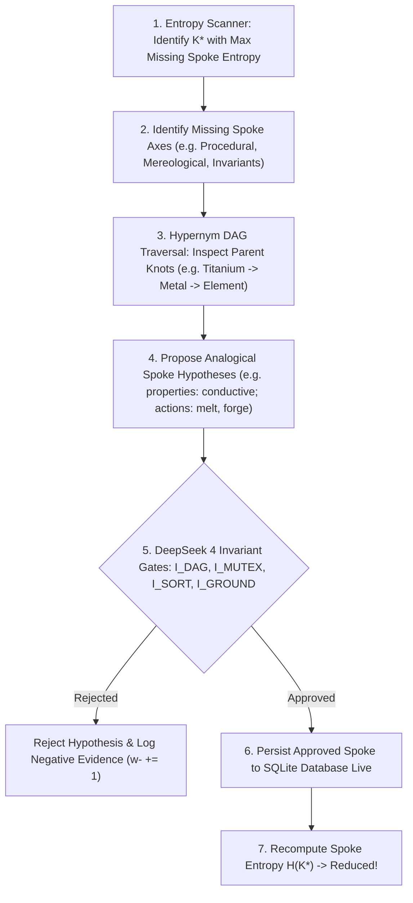

# Design Document: Autonomous Closed-Loop Curiosity & English/Math Mastery

**Date:** 2026-09-23  
**Status:** Approved for Implementation  
**Architecture:** MIVI Neuro-Symbolic Cognitive Architecture (v0.2.1)  
**Target Milestone:** Milestone 19 (`todo.md`) + English Dialogue & Mathematical Reasoning Core  

---

## 1. Vision & Core Philosophy

The primary objective is to make **LITTLE / MIVI** significantly more capable at:
1. **Natural English Dialogue & Learning**: Fluently engaging in multi-turn conversations, maintaining dialogue context, resolving pronouns/anaphora across turns, and parsing complex syntactic structures (compound sentences, restrictive relative clauses, conditional statements) without statistical guessing.
2. **Step-by-Step Mathematical Problem Solving**: Parsing and solving natural language math word problems (arithmetic, fractions, percentages, multi-step sequential changes, systems of linear equations, quadratic equations, unit conversions, and geometry) with 0% token error and inspectable intermediate reasoning traces (`<math_trace>`).
3. **Autonomous Closed-Loop Curiosity & Self-Study (Milestone 19)**: A background self-study engine that scans the 360° Concept Knot graph for maximal spoke entropy ($\max H(\text{Axis}_j)$), generates analogical hypotheses from parent hypernyms (e.g. inheriting metal properties and forging skills for titanium), rigorously checks hypotheses against DeepSeek Invariant Verification Gates ($\mathcal{I}_{\text{DAG}}, \mathcal{I}_{\text{mutex}}, \mathcal{I}_{\text{sort}}, \mathcal{I}_{\text{ground}}$), and automatically resolves contradictions in SQLite with **zero human intervention and zero reliance on statistical LLMs**.

---

## 2. Advanced English Comprehension & Conversational Engine

### 2.1 Dialogue Context & Anaphora / Coreference Tracking
A dedicated `DialogueContext` class tracks conversational flow across turns:
- **Salient Entities:** Tracks `active_subject`, `active_object`, and an ordered list of recently mentioned nouns with timestamps and semantic categories.
- **Pronoun Resolution:** Resolves personal and demonstrative pronouns:
  - `"it"` / `"that"` / `"this"` $\rightarrow$ binds to the most recent non-human singular concept (e.g., `"The apple is red. It is sweet."` $\implies$ `(apple, has_property, sweet)`).
  - `"they"` / `"them"` / `"these"` $\rightarrow$ binds to plural or group concepts.
  - `"he"` / `"she"` $\rightarrow$ binds to person/entity concepts.
  - `"the former"` / `"the latter"` $\rightarrow$ binds to the first or second mentioned entity in the immediate prior statement.
- **User Profile State:** Retains user-shared attributes (e.g., name, location, preferences) in a dedicated persistent entity `user` with automatic recall.

### 2.2 Complex Sentence & Relative Clause Parsing
Extend `SimpleParser` and `ConstructionGrammar` with dedicated grammatical constructions:
1. **Coordinate Compound Clauses (`CONJ_COORD`):**
   - Pattern: `<Clause 1> and <Clause 2>` where `<Clause 2>` contains anaphoric pronouns or elliptical subjects.
   - Example: *"A lion is an animal and it lives in the savanna."* $\implies$ generates `(lion, is_a, animal)` and `(lion, lives_in, savanna)`.
2. **Restrictive Relative Clauses (`REL_RESTRICT`):**
   - Pattern: `The <noun> that/which <verb phrase> is <predicate nominal>`
   - Example: *"The animal that has black and white stripes and lives in Africa is a zebra."*
   - Parsing: Extracts the restrictive conditions as defining criteria and asserts equivalence/hyponymy to the target concept.
3. **Descriptive & Modifying Adjectival Clauses (`ADJ_MOD`):**
   - Pattern: `<Adjective> <Noun> is <Predicate>`
   - Example: *"A ripe banana is yellow and soft."* $\implies$ creates state-dependent concept attributes.
4. **Indirect & Polite Query Formulations (`POLITE_Q`):**
   - Pattern: `"Can you tell me if X is Y?"`, `"Do you know whether X has Z?"`, `"Explain why X is not Y"` $\rightarrow$ stripped to underlying semantic query without conversational distortion.

### 2.3 Contextual & Fluent Verbalization
Upgrades `InferenceResult.verbalize()` to produce natural, human-friendly English:
- For deductive proofs: *"Yes, a dog is a living thing. I deduced this because a dog is an animal, and an animal is a living thing."*
- For invariant refutations: *"No, that's impossible. A car is an artifact, which is mutually exclusive with living things."*
- For epistemic unknowns: *"I don't have enough observations about 'X' in my memory yet. What kind of thing is it?"*
- For procedural math: Includes conversational intro + explicit `<math_trace>` + final answer sentence.

---

## 3. Deterministic Multi-Step Mathematical Problem Solver

### 3.1 Semantic Math Word Problem Solver (`MathStorySolver`)
A rule-based semantic parser that decomposes natural language word problems into typed mathematical representations:
1. **Sequential State Changes:**
   - Detects initial quantities, additions, subtractions, and transfers.
   - Example: *"John has 15 apples. He gives 4 to Mary and buys 6 more. How many apples does John have?"*
   - Decomposition: $\text{initial} = 15 \rightarrow \text{sub}(4) \rightarrow 11 \rightarrow \text{add}(6) \rightarrow 17$.
2. **Multiplicative & Fractional Scaling:**
   - Detects proportional relations: `"twice as many"`, `"3 times as many"`, `"half as much"`, `"one third of"`.
   - Example: *"Alice has 24 marbles. Bob has half as many as Alice. Charlie has 5 more than Bob. How many marbles does Charlie have?"*
   - Decomposition: $\text{Alice} = 24 \implies \text{Bob} = 24 / 2 = 12 \implies \text{Charlie} = 12 + 5 = 17$.
3. **Part-Whole & Division / Remainder:**
   - Detects distribution across containers/groups: *"There are 47 students. Each bus holds 10 students. How many buses are needed?"*
   - Decomposition: $\lceil 47 / 10 \rceil = 5$ buses.

### 3.2 Symbolic CAS Engine (`SymbolicCAS`)
Implemented as a deterministic procedural library in `src/little/procedural/math_cas.py`:
- **Arbitrary Precision & Rational Fractions:** Native `fractions.Fraction` and `decimal.Decimal` guaranteeing 0.0% floating point rounding drift:
  $$\frac{3}{7} + \frac{5}{14} = \frac{11}{14}$$
- **Linear Systems:** Solves 2-variable and 3-variable linear systems using Cramer's rule / Gaussian elimination:
  $$\begin{cases} 2x + 3y = 13 \\ x - y = 4 \end{cases} \implies x = 5, y = 1$$
- **Quadratic Equations:** Exact closed-form quadratic formula with real or imaginary root detection:
  $$ax^2 + bx + c = 0 \implies x = \frac{-b \pm \sqrt{b^2 - 4ac}}{2a}$$
- **Dimensional Analysis & Unit Conversions:** Multi-domain unit registry (length, mass, time, temperature, speed, area, volume):
  $$100\text{ km/h} = 27.778\text{ m/s}, \quad 100^\circ\text{C} = 212^\circ\text{F} = 373.15\text{K}$$
- **Geometry Solver:** Exact formulas for perimeter, circumference, area, surface area, and volume of circles, triangles, rectangles, trapezoids, spheres, cylinders, and cones.

### 3.3 Inspectable `<math_trace>` Format
Every math problem produces an inspectable trace:
```text
<math_trace>
Problem: "Alice has 24 marbles. Bob has half as many as Alice. Charlie has 5 more than Bob. How many does Charlie have?"
Step 1: Identified entity Alice with quantity = 24
Step 2: Computed Bob = Alice * (1/2) = 24 * 0.5 = 12
Step 3: Computed Charlie = Bob + 5 = 12 + 5 = 17
Final Answer: 17
</math_trace>
Charlie has 17 marbles.
```

---

## 4. Autonomous Closed-Loop Curiosity & Self-Study Engine (Milestone 19)

### 4.1 Spoke Entropy Metric Across 360° Concept Knots
The curiosity engine evaluates the information deficit of every concept knot $K \in \mathcal{K}$ across its 6 orthogonal axes:
$$H(K) = \sum_{j=1}^{6} w_j \cdot \Psi_j(K)$$
where the penalty indicator $\Psi_j(K) \in [0, 1]$ measures the degree of missingness:
1. **$\Psi_1$ (Taxonomy 90°):** $1.0$ if no hypernym edge exists; $0.0$ if rooted in top-level ontology.
2. **$\Psi_2$ (Mereology 135°):** $1.0$ if 0 parts known; $0.5$ if only 1 part known; $0.0$ if $\ge 2$ boundary/internal parts defined.
3. **$\Psi_3$ (Continuous Dynamics 45°):** $1.0$ if uncalibrated default state ($f=1.0, o=0.0$) and no decay/transformation dynamics registered.
4. **$\Psi_4$ (Invariant Axioms & Mutex 180°):** $1.0$ if no disjoint constraints or physical conservation laws attached.
5. **$\Psi_5$ (Procedural Skills 225°):** $1.0$ if no executable actions registered for the concept.
6. **$\Psi_6$ (Episodic Grounding 0°):** $0.5$ if never observed in a concrete episodic instance.

The concept with maximal entropy is prioritized for autonomous self-study:
$$K^* = \arg\max_{K \in \mathcal{K}} H(K)$$

### 4.2 Closed-Loop Analogical Self-Study Pipeline
When $K^*$ is selected (e.g. `titanium`):


1. **Hypernym Inheritance:** Gathers shared characteristics from immediate and ancestor hypernyms in the DAG.
2. **Hypothesis Formulation:** Synthesizes concrete candidate relations (e.g., `(titanium, is_a, conductor)`, `(titanium, has_property, ductile)`, `(titanium, can, melt)`).
3. **Verification via DeepSeek 4 Gates:**
   - $\mathcal{I}_{\text{DAG}}$: Ensures adding the hypothesis introduces no directed cycles.
   - $\mathcal{I}_{\text{mutex}}$: Ensures the hypothesis does not contradict any ontological disjointness axiom (e.g., asserting `titanium is_a living_thing` is blocked).
   - $\mathcal{I}_{\text{sort}}$: Type signature compatibility check.
   - $\mathcal{I}_{\text{ground}}$: Evidence confidence calibration.
4. **Contradiction Resolution:** If an edge contradicts an existing belief:
   - Uses NARS evidence revision $c = w^+ / (w^+ + w^- + 1)$.
   - If accumulated negative evidence outweighs positive evidence ($w^- > w^+$), the old contradictory relation is marked refuted or automatically pruned from SQLite.

### 4.3 CLI Commands & Interactive Self-Study
- `little study [--concept <name>] [--steps <N>] [--verbose]`:
  - Runs autonomous closed-loop self-study for $N$ iterations, printing each hypothesis, gate verification result, and SQLite update.
- `little curious`:
  - Displays a ranked leaderboard of concepts with the highest spoke entropy and lists their primary curiosity gaps.
- `--auto-study` flag in `little chat`:
  - Allows the model to autonomously investigate missing spokes in the background between user conversation turns.

---

## 5. Implementation Architecture & File Layout

| Module | File Path | Purpose |
| :--- | :--- | :--- |
| **Dialogue Context** | `src/little/language/dialogue.py` | Multi-turn state, coreference/anaphora resolution, entity salience. |
| **Grammar & Complex Parsing** | `src/little/language/parser.py` (extended) | Restrictive relative clauses, coordinate clauses, compound sentences. |
| **Symbolic Math Engine** | `src/little/procedural/math_cas.py` | Exact rational arithmetic, linear systems, quadratic equations, unit conversions, geometry. |
| **Math Story Solver** | `src/little/procedural/math_story.py` | Natural language word problem decomposition into solvable mathematical graphs. |
| **Curiosity & Self-Study** | `src/little/active/self_study.py` | Spoke entropy calculation, hypernym analogical hypothesis generation, closed-loop execution. |
| **CLI & Commands** | `src/little/main.py` (extended) | Adds `little study` and `little curious` subcommands and conversational updates. |

---

## 6. Verification & Test Plan

1. **Unit Tests: Dialogue & Coreference (`tests/unit/test_dialogue_context.py`):**
   - Pronoun resolution (`it`, `they`, `that`).
   - Coordinate clause extraction (*"A dog is an animal and it barks"* $\implies 2$ relations).
   - Restrictive relative clauses (*"The animal that has wings and flies is a bird"*).
2. **Unit Tests: Math Word Problems & Symbolic CAS (`tests/unit/test_math_story_and_cas.py`):**
   - Multi-step word problems (sequential buying/giving, half/double scaling).
   - Exact fractions and decimals (`1/3 + 1/6 = 1/2`).
   - 2x2 linear systems and quadratic equation roots.
   - Unit conversions (km/h $\rightarrow$ m/s, Celsius $\rightarrow$ Fahrenheit).
3. **Unit Tests: Autonomous Self-Study Loop (`tests/unit/test_self_study_loop.py`):**
   - Spoke entropy calculation across 6 axes.
   - Autonomous discovery and verification of missing spokes for concepts (e.g. `titanium` inheriting from `metal`).
   - Automatic rejection of contradictory hypotheses violating $\mathcal{I}_{\text{mutex}}$.
   - Live SQLite persistence and entropy reduction.
4. **Integration Tests (`tests/integration/test_curiosity_chat_integration.py`):**
   - Full conversational flow in `little chat`: user introduces concepts, model resolves pronouns, solves word problems, and runs autonomous background self-study.
5. **Full Regression Test Suite:**
   - Maintain 100% pass rate across all existing 74 pytest tests.
