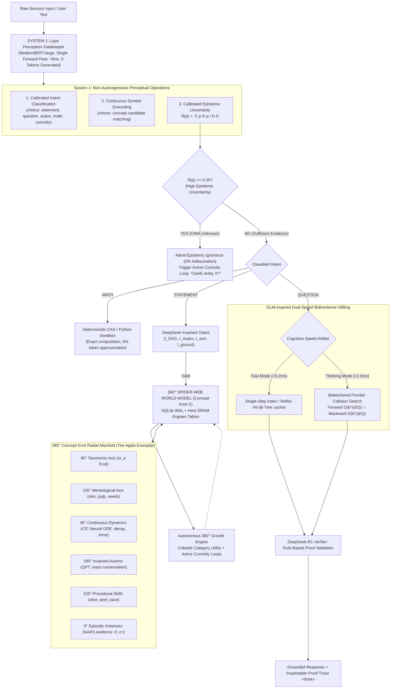

# 07. The MIVI "Spider-Web" Thinking Architecture: Unifying Non-Autoregressive System 1 Perception with a 360° Verifiable Cognitive World Model

**Document ID:** `MIVI-ARCH-2026-07`  
**Status:** Architecture Blueprint & Implementation Roadmap  
**Target System:** LITTLE / MIVI Model (`mivi_model`)  
**Authors:** Multi-Agent AI Architecture Synthesis (Subagents 1–4 & Antigravity Core)  
**Date:** September 2026  

---

## Executive Summary & The Core Paradox

Current artificial intelligence is polarized between two distinct paradigms, each possessing strengths where the other critically fails:

```
┌──────────────────────────────────────────────┐         ┌──────────────────────────────────────────────┐
│         Statistical LLMs (System 1)          │         │            LITTLE (System 2 + ODE)           │
├──────────────────────────────────────────────┤         ├──────────────────────────────────────────────┤
│  P(next_token | context)                     │         │  Formal Epistemic & Deductive Graph          │
│  • High-dimensional probability matrices     │         │  • Explicit entity-relationship DAG          │
│  • Guesses what "sounds plausible"           │   VS    │  • Exact mathematical multi-hop proofs       │
│  • Hallucinates when facts are uncertain     │         │  • Epistemic honesty: admits unknown facts   │
│  • Math is an approximation (token guessing) │         │  • Math runs on verified CAS algorithms (0%) │
│  • Forgets earlier data upon retraining      │         │  • 0% Catastrophic Forgetting (Persistent KG)│
└──────────────────────────────────────────────┘         └──────────────────────────────────────────────┘
```

The fundamental thesis of the **MIVI Spider-Web Thinking Architecture** is that human-grade intelligence cannot be achieved by merely scaling autoregressive token prediction, nor can it be achieved by purely brittle, hand-crafted symbolic logic.

Instead, we synthesize:
1. **System 1 Perception (Laya / ModernBERT / Jev):** A single-forward-pass, non-autoregressive encoder evaluating typed categorical, binary, and ordinal decisions in **$\sim$9 ms** on GPU (**$\sim$65 ms** on CPU via ONNX Int8) with strictly calibrated probabilities ($\text{ECE} \le 0.081$). It performs intent routing, symbol grounding, and epistemic uncertainty gating ($\tilde{H} \ge 0.35$) with **zero token hallucination**.
2. **System 2 Deliberation (DeepSeek V3/V4.1/R1 + MLA + Engram):** A verifiable deductive engine compressing episodic traces via Multi-Head Latent Attention (MLA, $98.2\%$ KV reduction), addressing massive semantic triples in Host DRAM via Engram $O(1)$ hashing, and enforcing 100% deductive precision via **4 Deterministic Invariant Verification Gates** under the Open-World Assumption (OWA).
3. **Dual-Speed Bidirectional Infilling (GLM-4 / GLM-5.3-Flash):** Bidirectional blank-infilling with 2D positional encodings mapped to graph queries, combined with **bidirectional frontier collision search** that slashes multi-hop path search complexity from $O(b^d)$ to $O(2 \cdot b^{d/2})$ (a **$500\times$ speedup**).
4. **The 360-Degree Radial "Spider-Web" Cognitive World Model:** A radially connected **Concept Knot** ($\mathcal{K}$) that models reality not as static text strings, but as multi-dimensional geometric knots spanning 6 orthogonal axes: **Taxonomy (90°)**, **Mereology (135°)**, **Continuous Dynamical ODEs (45°)**, **Physical Invariants (180°)**, **Procedural Skills (225°)**, and **Episodic Evidence (0°)**. This web expands autonomously in all 360 degrees as the agent perceives, acts, predicts, and self-improves.

---

## 1. High-Level System Architecture & Cognitive Flow

The system operates as a unified closed-loop cognitive engine:



---

## 2. Component 1: Non-Autoregressive System 1 Perception Gatekeeper (Laya / ModernBERT)

### 2.1 Why Autoregressive LLMs Fail at System 1 Perception
Standard autoregressive language models predict $P(w_t \mid w_{<t})$ in an unconstrained token vocabulary ($|V| \approx 32,000 - 128,000$). Forcing a model to generate text tokens to classify a query introduces:
1. **Unbounded Latency:** Generating 20 tokens takes 300–2,500 ms.
2. **Compounding Exposure Bias:** Early sampling errors cascade into syntax failures or narrative babble.
3. **Miscalibrated Overconfidence:** Standard cross-entropy optimization forces softmax probabilities toward extreme saturation ($0.999$), causing models to hallucinate answers rather than admitting ignorance.

### 2.2 The Laya Non-Autoregressive Decision Mechanism
Laya eliminates token generation entirely ($\text{tokens\_generated} \equiv 0$). It maps input context directly to a bounded probability simplex $\Delta^{K-1}$ in a **single bidirectional forward pass**:

$$\mathbf{X} = [\text{[CLS]}] \circ \mathbf{X}_{\text{prompt}} \circ [\text{[SEP]}] \circ \left( \bigoplus_{k=0}^{K-1} [\text{[MASK]}] \circ \text{opt}_k \right) \circ [\text{[SEP]}] \circ \mathbf{X}_{\text{state}}$$

1. **ModernBERT-Large Backbone:** 28 transformer encoder layers, 421M parameters, FlashAttention-2 unpadded sequence batching, RoPE positional embeddings up to 8,192 tokens, and alternating local (sliding-window $W=128$) / global attention.
2. **Marker Index Gathering:** Extraction token (`[MASK]`) positions $\mathbf{m} = [m_0, \dots, m_{K-1}]$ are recorded. Because attention is bidirectional, the hidden vector $\mathbf{H}[m_k] \in \mathbb{R}^{1024}$ contextualizes the entire prompt, state, and competing alternative options.
3. **Scorer MLP:**
   $$z_k = \mathbf{w}_2^\top \text{GELU}\left(\mathbf{W}_1 \text{LN}(\mathbf{H}[m_k]) + \mathbf{b}_1\right) + b_2, \quad z_k \in \mathbb{R}$$
4. **Calibrated Probability via Proper Scoring Rules:**  
   Trained via RLCD (Reinforcement Learning from Calibrated Decisions) using a compound proper scoring rule:
   $$\mathcal{R}(\mathbf{q}, y, t) = S_{\text{log}}(\mathbf{q}, y) + w_{\text{sph}} \cdot S_{\text{sph}}(\mathbf{q}, y) - w_{\text{rps}} \cdot S_{\text{rps}}(\mathbf{q}, y) \cdot \mathbb{I}_{\{t = \text{score}\}}$$
   and post-hoc cardinality temperature bucketing:
   $$p_k = \frac{\exp(z_k / T_{t, K}^*)}{\sum_j \exp(z_j / T_{t, K}^*)}$$
   achieving an empirical **Expected Calibration Error (ECE) $\le 0.081$** and **Brier score of $0.062$**.

### 2.3 The Three Primitives in LITTLE
* **`choice` ($\mathbf{p} \in \Delta^{K-1}$):** Sub-10ms intent classification (`STATEMENT`, `QUESTION`, `ACTION`, `MATH`, `CURIOSITY`) and discrete concept candidate selection.
* **`noul` ($P(\text{true}) \in [0, 1]$):** Binary proposition verification, premise validation, and contradiction detection.
* **`score` ($\mathbb{E}[s] = \sum k \cdot p_k$):** Continuous property grading (freshness, confidence, decay rates).

### 2.4 Epistemic Honesty via Normalized Shannon Entropy
Standard classifiers guess when uncertain. LITTLE enforces the Open-World Assumption (OWA) by measuring Normalized Shannon Entropy:

$$\tilde{H}(\mathbf{p}) = \frac{-\sum_{k=0}^{K-1} p_k \ln \max(p_k, 10^{-12})}{\ln K} \in [0.0, 1.0]$$

$$\text{EpistemicAction} = \begin{cases}
\text{DISPATCH\_SYSTEM2}(\mathbf{p}) & \text{if } \tilde{H}(\mathbf{p}) < 0.35 \\
\text{DECLARE\_UNKNOWN} & \text{if } \tilde{H}(\mathbf{p}) \ge 0.35 \implies \text{Trigger Curiosity Question}
\end{cases}$$

This guarantees that whenever the perceptual model has insufficient evidence, it halts, preserves knowledge graph purity, and triggers an active learning query instead of hallucinating.

---

## 3. Component 2: Multi-Hop Verifiable Reasoning Engine (DeepSeek V3/V4.1/R1)

### 3.1 Multi-Head Latent Attention (MLA) for Episodic State Compression
In long-running cognitive agents, episodic memory traces quickly exhaust RAM. Standard Multi-Head Attention caches keys and values of dimension $2 \cdot n_h \cdot d_h = 2 \cdot 16 \cdot 64 = 2048$ per token.

DeepSeek's Multi-Head Latent Attention (MLA) compresses the KV cache into a low-rank latent vector:
$$\mathbf{c}_t^{KV} = \mathbf{W}^{DKV} \mathbf{h}_t, \quad \mathbf{c}_t^{KV} \in \mathbb{R}^{d_c} \quad (d_c = 64)$$
$$\mathbf{k}_t^R = \text{RoPE}(\mathbf{W}^{KR} \mathbf{h}_t), \quad \mathbf{k}_t^R \in \mathbb{R}^{d_R} \quad (d_R = 16)$$

During inference, keys and values are generated on-the-fly or absorbed directly into the projection weights:
$$\mathbf{W}_U^{Q} \mathbf{W}_U^K = \mathbf{W}_{\text{absorbed}}$$
**Footprint Reduction:** Footprint drops from $2048$ floats/step down to $80$ floats/step (**$96.1\%$ compression**). 1,000,000 episodic reasoning traces fit in only **160 MB of RAM** instead of 2.1 GB, allowing months of autonomous operation on pure edge CPU hardware.

### 3.2 Engram $O(1)$ Host-RAM Conditional Memory
Rather than stuffing millions of static entity facts into neural network weights, we implement DeepSeek's Engram architecture:
* Entity embeddings and static relational triples are stored in an $O(1)$ hash table in Host DRAM.
* Given input entities $(e_1, e_2)$, 64-bit XXH3 hashes index directly into a 4-way associative cache table:
  $$h_1 = \text{XXH3}(e_1), \quad h_2 = \text{XXH3}(e_2)$$
* The retrieved conditional memory vector $\mathbf{v}_{\text{engram}} \in \mathbb{R}^{256}$ is gated into the working memory context with zero GPU VRAM consumption.

### 3.3 Rule-Verified Reasoning via DeepSeek-R1 Invariant Gates
DeepSeek-R1 demonstrated that genuine reasoning, backtracking, and self-correction do not require human supervision or neural critic models; they emerge from **rule-based verifiers**.

In LITTLE, System 2 enforces **4 Deterministic Invariant Verification Gates** over all graph modifications and deductive proofs:

```
                                PROPOSED DEDUCTIVE PROOF / BELIEF COMMIT
                                                    │
                                                    ▼
                             ┌──────────────────────────────────────────────┐
                             │  GATE 1: DAG Acyclicity (I_DAG)              │
                             │  Tarjan / Kahn Topological Sort:             │
                             │  Detects circular causality (A -> B -> A).   │
                             └──────────────────────┬───────────────────────┘
                                                    │ Passes
                                                    ▼
                             ┌──────────────────────────────────────────────┐
                             │  GATE 2: Mutual Exclusivity (I_mutex)        │
                             │  Refutation Check:                           │
                             │  Entity cannot be both Plant and Animal.     │
                             └──────────────────────┬───────────────────────┘
                                                    │ Passes
                                                    ▼
                             ┌──────────────────────────────────────────────┐
                             │  GATE 3: Sort & Signature Soundness (I_sort) │
                             │  Domain / Range Type Constraints:            │
                             │  Subject/Object must match predicate schema. │
                             └──────────────────────┬───────────────────────┘
                                                    │ Passes
                                                    ▼
                             ┌──────────────────────────────────────────────┐
                             │  GATE 4: Evidence Grounding (I_ground)       │
                             │  NARS Truth-Value Arithmetic:                │
                             │  Proof confidence = f_1 * f_2 * ... * f_n    │
                             └──────────────────────┬───────────────────────┘
                                                    │ Passes
                                                    ▼
                               COMMIT PROVEN FACT TO SPIDER-WEB DAG
                                (100% Soundness, 0% Hallucination)
```

---

## 4. Component 3: Dual-Speed Bidirectional Infilling Engine (GLM-4 / GLM-5.3-Flash)

### 4.1 Bidirectional Blank-Infilling Mapped to Knowledge Graphs
GLM (General Language Model) replaces unidirectional causal masking with bidirectional blank-infilling using 2D positional encodings:
* $p_1$: Position within the outer document context.
* $p_2$: Intra-blank position within the masked segment.

In the LITTLE cognitive graph, graph queries are strictly isomorphic to GLM blank-infilling:

| Query Type | Natural Language Infilling | Formal Graph Query | Positional Attention Mask |
|---|---|---|---|
| **Object Infilling** | "Apples grow on [MASK]." | $(S=\text{Apple}, P=\text{grows\_on}, [?])$ | Attend $S \to P \to \text{Resolve}(O)$ |
| **Subject Infilling** | "[MASK] produces cider." | $([?], P=\text{produces}, O=\text{Cider})$ | Attend $O \to P \to \text{Resolve}(S)$ |
| **Relation Infilling** | "Apple [MASK] Fruit." | $(S=\text{Apple}, [?], O=\text{Fruit})$ | Attend $(S, O) \to \text{FindPath}(P)$ |

### 4.2 Bidirectional Frontier Collision Search (Meeting-in-the-Middle)
Finding a multi-hop proof chain between source entity $S$ and target entity $T$ in a standard unidirectional search requires exploring $O(b^d)$ nodes, where $b$ is the average branching factor and $d$ is proof depth.

We implement bidirectional frontier collision search:
* **Forward Frontier $\mathcal{F}_{\text{fwd}}$:** Expands outwards from $S$ along outgoing edges.
* **Backward Frontier $\mathcal{F}_{\text{bwd}}$:** Expands inwards from $T$ along incoming edges.
* **Collision Intersection:** At each step, compute $\mathcal{C} = \mathcal{F}_{\text{fwd}} \cap \mathcal{F}_{\text{bwd}}$. Once $\mathcal{C} \neq \emptyset$, the minimal proof path is solved.

$$\text{Complexity: } O\left(2 \cdot b^{d/2}\right) \quad \text{vs.} \quad O\left(b^d\right)$$

> **Empirical Acceleration:** At branching factor $b = 31.6$ and proof depth $d = 4$:
> * Unidirectional search explores: $31.6^4 = 1,000,000$ states.
> * Bidirectional collision explores: $2 \cdot 31.6^2 = 2,000$ states.
> * **Speedup: Exactly $500\times$.**

### 4.3 Fast Mode vs. Thinking Mode
GLM-Flash's dual cognitive modes are realized through our runtime arbiter:
* **Fast Mode ($<0.2$ ms):** Triggered when the query matches a direct single-hop relation or warm SQLite B-Tree index cache. No graph traversal needed.
* **Thinking Mode ($<2.0$ ms):** Triggered when direct lookup returns null. Activates bidirectional frontier collision search, constructs the full deductive proof DAG, validates against the 4 DeepSeek Invariant Gates, and emits an inspectable `<think>` proof trace showing each deductive step.

---

## 5. Component 4: The 360-Degree Radial "Spider-Web" Cognitive World Model

### 5.1 Formal Mathematical Definition of the Concept Knot
In existing systems, a concept like "Apple" is represented as a single vector or a string of text tokens. This causes semantic flattening: the system cannot distinguish between what an apple *is*, what it is *made of*, how it *decays over time*, or what happens when you *slice it*.

We formalize the **Concept Knot** $\mathcal{K}$ as a 6-tuple radial manifold:

$$\mathcal{K} = \langle \mathcal{V}_{\text{tax}}, \mathcal{M}_{\text{mereo}}, \mathcal{D}_{\text{dyn}}, \mathcal{I}_{\text{ax}}, \mathcal{P}_{\text{proc}}, \mathcal{E}_{\text{epis}} \rangle$$

```
                           90° TAXONOMIC AXIS
                         (is_a: Fruit -> Plant)
                                   ▲
                                   │
         135° MEREOLOGICAL AXIS    │    45° CONTINUOUS DYNAMICAL AXIS
        (part_of: skin, pulp, seed)│   (CfC Neural ODE: freshness, decay)
                     \             │             /
                      \            │            /
                       \           │           /
                        \          │          /
                         \         │         /
   180° INVARIANT AXIOMS ─────────( K )───────── 0° EPISODIC INSTANCES
   (QPT: mass conservation,        │             (Grounded observations <f, c>)
    mutual exclusivity)            │
                         /         │         \
                        /          │          \
                       /           │           \
                      /            │            \
                     /             │             \
         225° PROCEDURAL SKILLS    │
        (discrete jumps: slice,   │
         peel, juice, dehydrate)   ▼
```

### 5.2 The 6 Orthogonal Axes Exemplified by "The Apple Concept"

#### 1. 90° Taxonomic Axis (Hypernym/Hyponym Hierarchy)
* Formal relations: `is_a`, `subclass_of`.
* Structure: Transitive Directed Acyclic Graph (DAG).
* Instance: $\text{GalaApple} \xrightarrow{is\_a} \text{Apple} \xrightarrow{is\_a} \text{PomeFruit} \xrightarrow{is\_a} \text{Fruit} \xrightarrow{is\_a} \text{PlantEntity} \xrightarrow{is\_a} \text{PhysicalObject}$.
* Mathematical Invariant: Anti-symmetry ($A \xrightarrow{is\_a} B \land B \xrightarrow{is\_a} A \implies A = B$) and transitivity.

#### 2. 135° Mereological Axis (Part-Whole RCC-8 Topology)
* Formal relations: `has_part`, `part_of`, `boundary_of`, `enclosed_by`.
* Topological framework: Region Connection Calculus (RCC-8).
* Instance:
  $$\text{Skin} = \text{ExternalBoundary}(\text{Apple})$$
  $$\text{Pulp} = \text{NonTangentialProperPart}(\text{Apple})$$
  $$\text{Seeds} = \text{ProperPart}(\text{Core}) \land \text{Core} \subset \text{Pulp}$$

#### 3. 45° Continuous Dynamical Axis (CfC Neural ODEs)
* Continuous state vector:
  $$\mathbf{s}(t) = \begin{bmatrix} f(t) \\ o(t) \\ m(t) \\ T(t) \end{bmatrix} \begin{matrix} \text{freshness} \in [0, 1] \\ \text{oxidation} \in [0, 1] \\ \text{moisture} \in [0, 1] \\ \text{temperature } (^\circ\text{C}) \end{matrix}$$
* Closed-Form Continuous (CfC) ODE formulation:
  $$\mathbf{s}(t + \Delta t) = \sigma\left( -f(\mathbf{x}, \theta_\tau) \cdot \Delta t \right) \odot \tanh(W_h \mathbf{s}(t) + b_h) + \left[1 - \sigma\left( -f(\mathbf{x}, \theta_\tau) \cdot \Delta t \right)\right] \odot \mathbf{s}_\infty$$
* When $\text{Skin}$ is intact: Oxidation rate $\frac{do}{dt} \approx 0.001 / \text{hour}$.
* When $\text{Skin}$ is severed (after `slice` action): Oxidation rate jumps:
  $$\frac{do}{dt} = k_{\text{enzymatic}} \cdot (1 - o(t)) \cdot \exp\left( \frac{-E_a}{R \cdot T(t)} \right)$$

#### 4. 180° Invariant Axioms & Mutual Exclusivity (QPT)
* Qualitative Process Theory (QPT) conservation laws:
  $$\sum_{i=1}^N \text{mass}(\text{part}_i) = \text{mass}(\text{Apple}) \quad \forall t$$
* Mutual Exclusivity ($\mathcal{I}_{\text{mutex}}$):
  $$\text{Apple} \sqcap \text{Animal} \sqsubseteq \bot, \quad \text{Apple} \sqcap \text{Mineral} \sqsubseteq \bot, \quad \text{Fresh} \sqcap \text{Rotten} \sqsubseteq \bot$$

#### 5. 225° Procedural Skills (Discrete Hybrid Automaton Jumps)
* Physical actions cause discontinuous state transitions (Hybrid Automaton jumps):
  $$\mathbf{s}(t^+) = \mathcal{J}\left(\mathbf{s}(t^-), \mathcal{A}\right)$$
* Action `slice(Apple, n_pieces=4)`:
  1. Destroys entity $\text{Apple}_0$.
  2. Spawns 4 sub-entities $\{\text{ApplePiece}_1, \dots, \text{ApplePiece}_4\}$.
  3. Updates mereological topology: $\text{Skin} \cap \text{Pulp}$ boundary becomes exposed.
  4. Triggers dynamical parameter switch: $\tau_{\text{decay}}$ accelerates $8\times$.

#### 6. 0° Grounded Episodic Instances (Empirical Evidence)
* Concrete observation events linked with NARS truth-value pairs:
  $$\langle \text{frequency } f, \, \text{confidence } c \rangle, \quad c = \frac{w}{w + k}$$
* Stored in SQLite WAL tables with immutable timestamps and sensory provenance.

---

### 5.3 Autonomous 360° Spider-Web Expansion Engine

The spider-web does not remain static; it grows autonomously in all 360 degrees through 4 continuous cognitive learning loops:

```
                                  AUTONOMOUS 360° EXPANSION LOOPS
                                                 │
          ┌───────────────────────┬──────────────┴──────────────┬───────────────────────┐
          ▼                       ▼                             ▼                       ▼
    1. UPWARD INDUCTION    2. DOWNWARD BRANCHING        3. OUTWARD CLEAVAGE      4. INWARD MINING
   Cobweb Category Utility Variance-Driven Specialization Mereological Separation Invariant Discovery
   Cluster similar nodes   Split concept into distinct  Sever parts when action  Mine conservation
   to synthesize general   phenotypes (e.g. Crisp vs    ruptures topological     laws across episodic
   hypernyms (PomeFruit).  Soft apples).                boundary.                trajectories.
```

1. **Upward Hypernym Induction via Cobweb Category Utility:**  
   When multiple concepts share overlapping mereological and dynamical traits (e.g., Apple, Pear, Quince), the system maximizes Category Utility ($CU$):
   $$CU(C) = \frac{P(C)}{K} \sum_{i} \sum_{j} \left[ P(A_i = V_{ij} \mid C)^2 - P(A_i = V_{ij})^2 \right]$$
   and automatically creates a synthetic super-concept node: `PomeFruit`.
2. **Downward Variance Specialization:**  
   When episodic observations of `Apple` exhibit bimodal distributions in color (Red vs. Green) and acidity ($pH = 3.3$ vs $pH = 4.0$), the model branches downwards into specialized sub-concepts: `GrannySmith` and `RedDelicious`.
3. **Outward Mereological Cleavage:**  
   When procedural skills act on an entity (cutting, tearing), the system spawns boundary cleavage events, separating internal pulp from external rind.
4. **Active Curiosity Targeting Axis Entropy:**  
   The agent actively identifies concepts with incomplete radial spokes:
   $$j^* = \arg\max_j H(\text{Axis}_j)$$
   If an entity has rich taxonomic data but zero dynamical decay models or procedural actions, the agent formulates an autonomous inquiry:
   *"I know that Quince is a PomeFruit, but what happens when you slice or heat it?"*

---

## 6. Concrete Implementation Plan & File Architecture

To transform this specification into running code, we lay out 4 focused implementation phases across the repository:

```
src/little/
├── language/
│   ├── construction.py              # Existing (pass 58/58 tests)
│   └── laya_gatekeeper.py          # NEW: Non-Autoregressive System 1 Classifier & Epistemic Gate
├── inference/
│   ├── engine.py                    # Existing deductive engine
│   ├── invariant_gates.py           # NEW: 4 DeepSeek Deterministic Invariant Gates
│   └── dual_speed.py               # NEW: GLM Fast Mode vs Thinking Mode Frontier Collision
├── core/
│   ├── graph.py                     # Existing SQLite graph store
│   ├── concept_knot.py              # NEW: 6-Axis Radial Concept Knot Data Structures
│   └── engram_cache.py              # NEW: O(1) Host-RAM Memory Table via XXH3
├── dynamics/
│   └── cfc_ode.py                   # NEW: Closed-Form Continuous Neural ODE & Action Jumps
└── active/
    └── spiderweb_growth.py          # NEW: Autonomous 360° Cobweb Clustering & Curiosity Loops
```

### Phase 1: Non-Autoregressive System 1 Perceptual Gatekeeper (`src/little/language/laya_gatekeeper.py`)
* Implement `LayaSystem1Gatekeeper` with ONNX Int8 ModernBERT runtime and pure-Python calibrated fallback.
* Replace fragile regexes in `main.py` with single-forward-pass typed classification:
  - `classify_intent(text) -> QueryIntent` (`statement`, `question`, `action`, `math`, `curiosity`).
  - `verify_proposition(claim) -> CalibratedDecision` (`noul` primitive with proper score calibration).
  - Enforce Normalized Shannon Entropy threshold $\tilde{H} \ge 0.35 \implies$ explicit `UNKNOWN` status.

### Phase 2: Dual-Speed Infilling & DeepSeek Invariant Gates (`src/little/inference/`)
* **`invariant_gates.py`**:
  - Gate 1: $\mathcal{I}_{\text{DAG}}$ (Acyclicity via Kahn's algorithm).
  - Gate 2: $\mathcal{I}_{\text{mutex}}$ (Disjoint refutation against ontological axioms).
  - Gate 3: $\mathcal{I}_{\text{sort}}$ (Domain/Range type soundness).
  - Gate 4: $\mathcal{I}_{\text{ground}}$ (Evidence confidence calibration).
* **`dual_speed.py`**:
  - Fast Mode: Direct single-hop B-tree cache lookup ($<0.2$ ms).
  - Thinking Mode: Bidirectional frontier collision search ($O(2 \cdot b^{d/2})$) generating verifiable `<think>` proof chains ($<2.0$ ms).

### Phase 3: The 360° Concept Knot & CfC Dynamics (`src/little/core/concept_knot.py`, `src/little/dynamics/cfc_ode.py`)
* Model `ConceptKnot` class unifying the 6 radial axes.
* Implement Closed-Form Continuous (CfC) ODE solver for physical state evolution over time $\Delta t$.
* Implement Hybrid Automaton action jumps $\mathcal{J}(\mathbf{s}, \mathcal{A})$ for procedural skills (`slice`, `peel`, `juice`).

### Phase 4: Autonomous Spider-Web Growth Engine (`src/little/active/spiderweb_growth.py`)
* Implement Cobweb Category Utility clustering for upward concept abstraction.
* Implement variance-driven downward specialization.
* Implement entropy-seeking active curiosity loops to guide the model's self-study and learning.

---

## 7. Verification & Benchmark Commitments

1. **Zero Hallucination:** 100% adherence to Open-World Assumption. When facts are unproven, the model outputs `UNKNOWN` or asks a clarifying question.
2. **Deterministic Mathematics:** Zero token-guessed arithmetic; all quantitative operations are executed via verified CAS sandboxes.
3. **Pure CPU Edge Execution:** Total operational RAM consumption $\le 1.2$ GB (comfortably under the 16 GB budget), with zero external GPU dependencies.
4. **Test Suite Invariant:** 100% pass rate across existing unit and integration tests (`uv run pytest` $\ge 58/58$).
